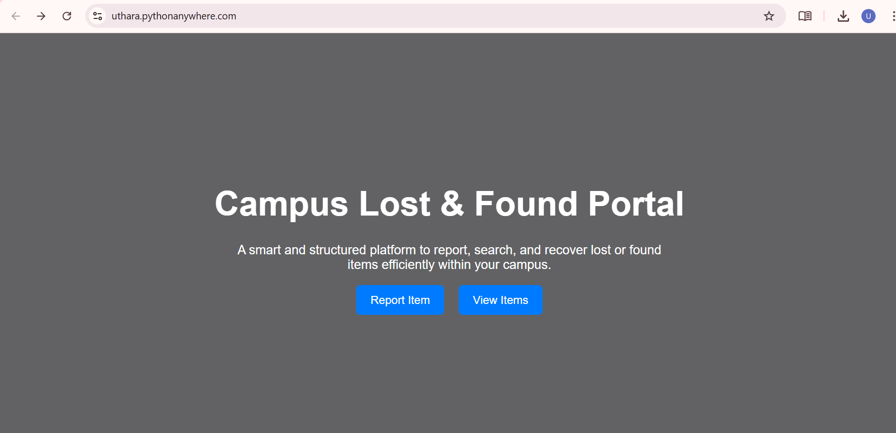
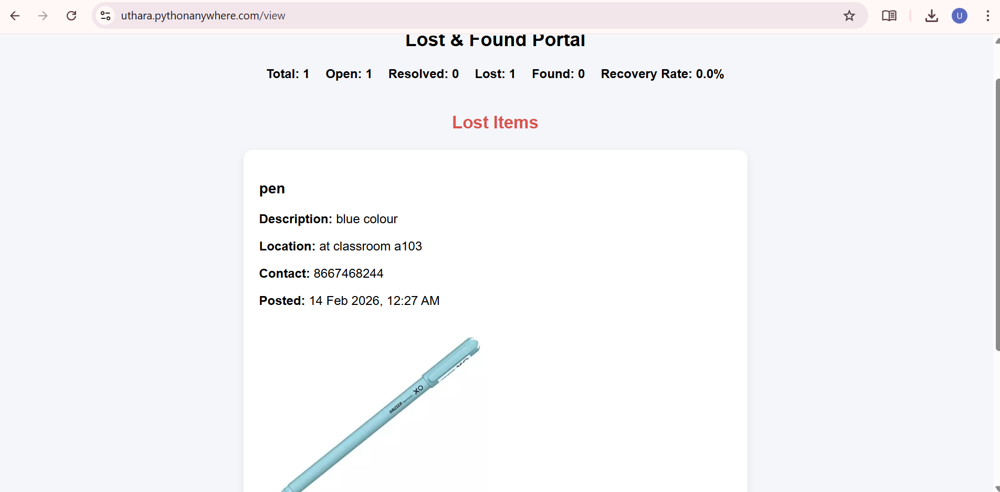
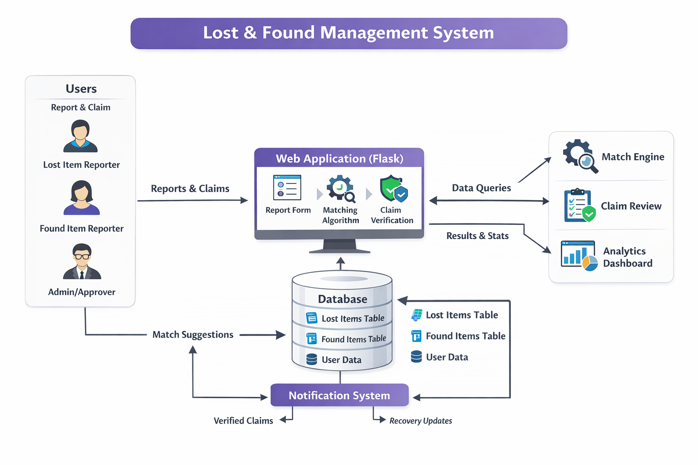
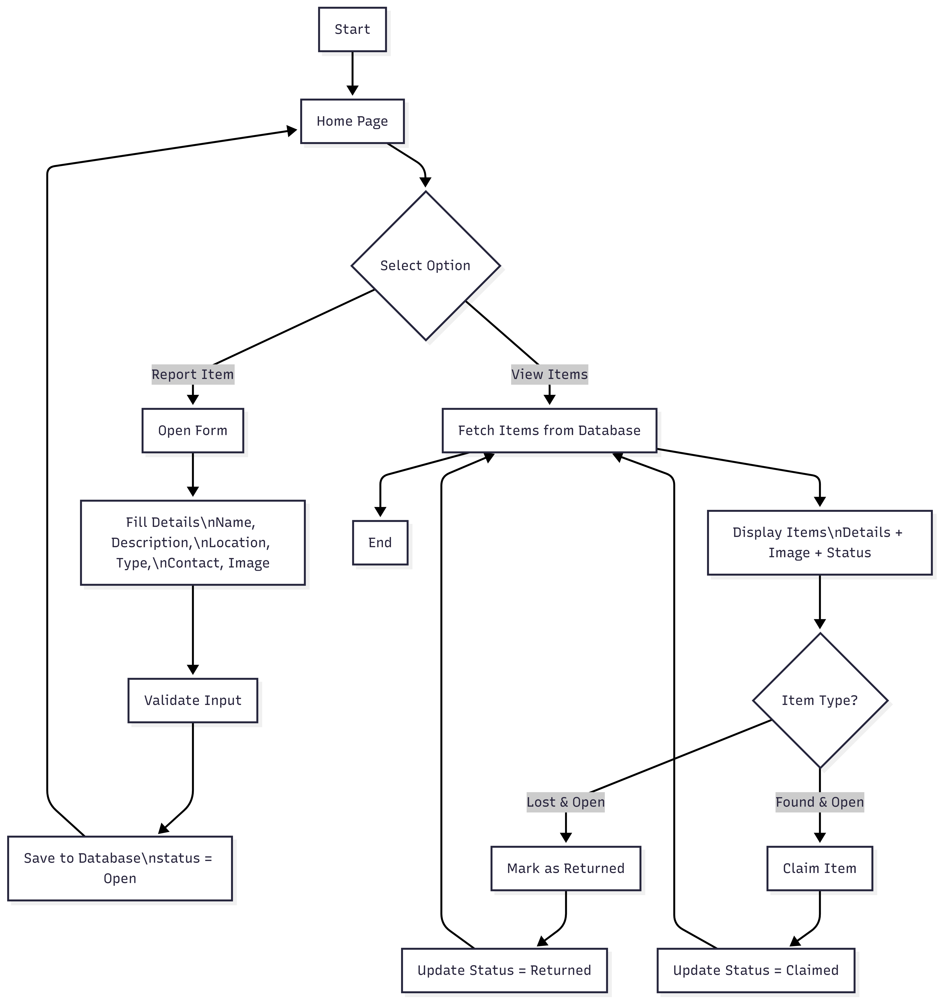

<p align="center">
  
</p>

# Campus Lost & Found Portal🎯

## Basic Details

### Team Name: UA Coders

### Team Members
- Member 1: Uthara Uthaman - College of engineering and management Punnapra
- Member 2: Anju M B - College of engineering and management Punnapra

### Hosted Project Link
https://uthara.pythonanywhere.com/

### Project Description
An intelligent Lost & Found management system that implements weighted multi-factor matching based on name, description, and location to automatically recommend best matches. It also includes claim verification workflow and recovery analytics.

### The Problem statement
In campuses and organizations, lost and found items are usually managed through informal communication like WhatsApp groups, notice boards, or word of mouth. This leads to poor tracking, duplicate posts, delayed recovery, and difficulty in verifying genuine claims. There is no centralized system to intelligently match lost and found items.

### The Solution
An intelligent Lost & Found management system that uses weighted similarity algorithms and a claim approval workflow to improve item recovery efficiency.

---

## Technical Details

### Technologies
- Languages used: Python,HTML,CSS
- Frameworks used:  Flask
- Libraries used: SQLite3,UUID,Datetime
- Tools used: VS Code,Git&Github,Render,Web Browser

---

## Features

List the key features of your project:
- Feature 1: Smart match detection using similarity scoring
- Feature 2: Claim request and approval system
- Feature 3: Centralized lost & found management
- Feature 4: Recovery analytics dashboard

---

## Implementation

#### Installation
```bash
[Installation commands - e.g., npm install, pip install -r requirements.txt]
```

#### Run
```bash
[Run commands - e.g., npm start, python app.py]
```

---

## Project Documentation

#### Screenshots (Add at least 3)


*A smarter way to manage lost and found.*


*Report lost or found items quickly and securely*


*Explore items and discover potential matches.*

#### Diagrams

**System Architecture:**


*Our system follows a client–server architecture where the frontend (HTML/CSS) interacts with a Flask backend. The backend handles business logic like multi-factor similarity matching and claim verification, and stores data in a SQLite database. User requests flow from the browser to Flask routes, which process the logic, interact with the database, and return updated results to the interface*

**Application Workflow:**


*Submit details, detect matches, verify claims, and complete recovery.*

---


## Project Demo

### Video
https://youtu.be/WTiscG6pW8o

*The video demonstrates the complete workflow of the Lost & Found system, starting from reporting an item to intelligent match detection and claim approval. It showcases key features such as multi-factor similarity matching, structured claim verification, and the recovery analytics dashboard. The user flow highlights how items are posted, matched automatically, claimed with proof, and approved for resolution. Technically, it demonstrates the interaction between the Flask backend, SQLite database, and the smart matching logic that improves recovery efficiency.*

---

## Team Contributions

- Uthara Uthaman Frontend development, API integration, Hosting
- Anju M B:  Backend development, Database design

---

## License

This project is licensed under the [MIT] License - see the [LICENSE](LICENSE) file for details.

---

Made with ❤️ at TinkerHub
